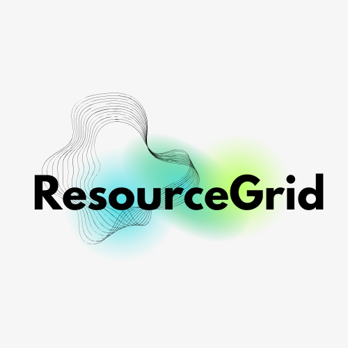

<div align="center">
  
  
  # ResourceGrid
  
  **Your Curated Collection of Essential Resources**
  
  [](https://github.com/Dev-Projets-Innovants/ResourceGrid/actions/workflows/deploy.yml)
  [](https://github.com/Dev-Projets-Innovants/ResourceGrid/stargazers)
  [](https://github.com/Dev-Projets-Innovants/ResourceGrid/network/members)
  [](https://github.com/Dev-Projets-Innovants/ResourceGrid/issues)
  [](https://github.com/Dev-Projets-Innovants/ResourceGrid/blob/main/LICENSE)
  
  [Live Demo](https://dev-projets-innovants.github.io/ResourceGrid/) • [Report Bug](https://github.com/Dev-Projets-Innovants/ResourceGrid/issues) • [Request Feature](https://github.com/Dev-Projets-Innovants/ResourceGrid/issues)
</div>

## 🌟 About ResourceGrid

ResourceGrid is a modern, responsive web application designed to help you organize and access your essential digital resources efficiently. With its futuristic design and intuitive interface, ResourceGrid provides a centralized platform for managing resources across different categories.

### ✨ Key Features

- **📂 Category Organization** - Organize resources by categories (Development, Design, Business, Education, Tools, etc.)
- **🔍 Advanced Search** - Powerful search functionality to quickly find resources
- **⭐ Featured Resources** - Highlight important resources with featured status
- **🎨 Modern UI** - Beautiful, responsive design with glassmorphism effects
- **📱 Mobile Responsive** - Fully optimized for all device sizes
- **🔄 Real-time Filtering** - Filter resources by category, tags, and search terms
- **📊 Resource Statistics** - Track resource counts and usage
- **🌙 Dark Theme** - Modern dark theme with purple gradient aesthetics

## 🚀 Live Demo

Visit the live application: [https://dev-projets-innovants.github.io/ResourceGrid/](https://dev-projets-innovants.github.io/ResourceGrid/)

## 🛠️ Built With

- **Frontend Framework**: [React 18](https://reactjs.org/) with TypeScript
- **Build Tool**: [Vite](https://vitejs.dev/)
- **Styling**: [Tailwind CSS](https://tailwindcss.com/) with custom animations
- **UI Components**: [shadcn/ui](https://ui.shadcn.com/) + [Radix UI](https://www.radix-ui.com/)
- **Icons**: [Lucide React](https://lucide.dev/)
- **State Management**: [TanStack React Query](https://tanstack.com/query/latest)
- **Database**: [Supabase](https://supabase.com/)
- **Routing**: [React Router DOM](https://reactrouter.com/)
- **Forms**: [React Hook Form](https://react-hook-form.com/) with [Zod](https://zod.dev/) validation

## 📦 Installation & Setup

### Prerequisites

- Node.js (version 18 or higher)
- npm or yarn package manager

### Local Development

1. **Clone the repository**
   ```bash
   git clone https://github.com/Dev-Projets-Innovants/ResourceGrid.git
   cd ResourceGrid
   ```

2. **Install dependencies**
   ```bash
   npm install
   ```

3. **Set up environment variables**
   ```bash
   cp .env.example .env.local
   ```
   Add your Supabase configuration to the `.env.local` file:
   ```env
   VITE_SUPABASE_URL=your_supabase_url
   VITE_SUPABASE_ANON_KEY=your_supabase_anon_key
   ```

4. **Start the development server**
   ```bash
   npm run dev
   ```

5. **Open your browser**
   Navigate to `http://localhost:5173` to view the application.

## 🚀 Deployment

### GitHub Pages (Current Deployment)

This project is automatically deployed to GitHub Pages using GitHub Actions. Every push to the `main` branch triggers the deployment workflow.

**Deployment URL**: [https://dev-projets-innovants.github.io/ResourceGrid/](https://dev-projets-innovants.github.io/ResourceGrid/)

### Manual Deployment

1. **Build the project**
   ```bash
   npm run build
   ```

2. **Preview the build locally**
   ```bash
   npm run preview
   ```

3. **Deploy to your preferred platform**
   - **Vercel**: Connect your GitHub repository to Vercel
   - **Netlify**: Drag and drop the `dist` folder or connect via Git
   - **GitHub Pages**: Push to `main` branch (automated via GitHub Actions)

## 📁 Project Structure

```
ResourceGrid/
├── public/                 # Static assets
├── src/
│   ├── components/        # Reusable UI components
│   │   ├── ui/           # shadcn/ui components
│   │   ├── AppHeader.tsx # Application header
│   │   ├── Sidebar.tsx   # Navigation sidebar
│   │   └── ...
│   ├── hooks/            # Custom React hooks
│   ├── integrations/     # External service integrations
│   │   └── supabase/     # Supabase configuration
│   ├── lib/              # Utility functions
│   ├── pages/            # Page components
│   └── main.tsx          # Application entry point
├── supabase/             # Database migrations
└── ...
```

## 🎯 Usage

1. **Browse Resources**: Use the sidebar to navigate between different categories
2. **Search**: Use the search bar to find specific resources
3. **Filter**: Apply filters to narrow down your results
4. **Sort**: Sort resources by title, category, or featured status
5. **View Details**: Click on resource cards to view more information

## 🤝 Contributing

We welcome contributions! Please see our contributing guidelines:

1. Fork the repository
2. Create a feature branch (`git checkout -b feature/amazing-feature`)
3. Commit your changes (`git commit -m 'Add some amazing feature'`)
4. Push to the branch (`git push origin feature/amazing-feature`)
5. Open a Pull Request

## 📝 License

This project is licensed under the MIT License - see the [LICENSE](LICENSE) file for details.

## 👥 Team

- **[Wambaforestin](https://github.com/Wambaforestin)** - Project Owner & Lead Developer
- **[Dev-Projets-Innovants](https://github.com/Dev-Projets-Innovants)** - Organization

## 🙏 Acknowledgments

- Thanks to all contributors who have helped shape ResourceGrid
- Special thanks to the open-source community for the amazing tools and libraries
- Icons provided by [Lucide](https://lucide.dev/)
- UI components inspired by [shadcn/ui](https://ui.shadcn.com/)

## 📞 Support

If you have any questions or need help, please:

- 📧 Open an [issue](https://github.com/Dev-Projets-Innovants/ResourceGrid/issues)
- ⭐ Star the repository if you find it useful
- 🍴 Fork the project to contribute

---

<div align="center">
  Made with ❤️ by the Dev-Projets-Innovants team
  
  ⭐ Star us on GitHub — it motivates us a lot!
</div>
